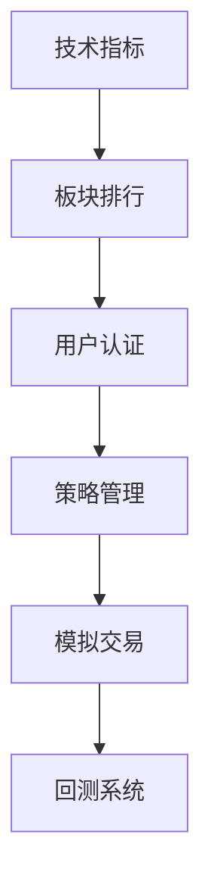

# WeQuant 量化交易平台 - 开发日志

## 2025-10-17 (最新重大更新) 🚀

### ✅ 重大突破：虚拟交易系统完成

1. **🎉 完整的虚拟交易系统上线**
   - ✅ **智能响应式图表系统** - 基于视窗比例的动态K线图
   - ✅ **完整的模拟交易功能** - 100万虚拟资金进行无风险交易
   - ✅ **双后端架构设计** - Python原型 + Java微服务生产架构
   - ✅ **真实市场数据集成** - akshare API提供实时A股数据
   - ✅ **专业交易界面** - 持仓管理、交易历史、盈亏计算

2. **📊 革命性的响应式图表系统**
   - ✅ JavaScript动态尺寸计算 - 实时测量页面元素占用空间
   - ✅ 视窗比例适配 - 16:9宽屏、21:9超宽屏、4:3普通屏、9:16竖屏
   - ✅ CSS自定义属性 - `--dynamic-chart-height`动态调整
   - ✅ 平滑过渡效果 - 窗口大小变化时的优雅动画
   - ✅ 设备自适应 - 移动设备、平板、桌面的最佳显示

3. **💰 专业级虚拟交易系统**
   - ✅ **账户系统** - 用户注册、100万虚拟资金分配
   - ✅ **交易引擎** - 买入/卖出、余额检查、持仓管理
   - ✅ **风险控制** - 手续费计算(万三)、资金充足性验证
   - ✅ **实时数据** - 真实股价获取、模拟价格波动
   - ✅ **盈亏计算** - 实时持仓价值、收益率计算

4. **🏗️ 微服务架构完善**
   - ✅ **Python原型服务** - Flask + SQLite快速原型验证
   - ✅ **Java生产服务** - Spring Boot + MySQL + Redis企业级架构
   - ✅ **前端统一接口** - 支持两种后端的API抽象层
   - ✅ **数据库设计** - 完整的交易、持仓、账户实体模型

### 📈 技术突破详解

#### 🎯 智能响应式系统
```javascript
// 动态计算最优图表高度
const updateDynamicSizing = () => {
  const viewport = { width: window.innerWidth, height: window.innerHeight, ratio: width/height }

  // 根据屏幕比例智能调整
  if (viewport.ratio >= 21/9) optimalHeight = viewport.height - 200  // 超宽屏
  else if (viewport.ratio >= 16/9) optimalHeight = viewport.height - 250  // 标准宽屏
  else if (viewport.ratio >= 4/3) optimalHeight = viewport.height - 300   // 普通屏
  else optimalHeight = viewport.height - 350  // 竖屏
}
```

#### 💼 虚拟交易核心逻辑
```python
# 买入交易处理
def execute_buy_order(account, stock_code, quantity, price):
    total_cost = amount + commission  # 交易金额 + 万三手续费
    if account.balance >= total_cost:  # 余额检查
        account.balance -= total_cost   # 扣除资金
        update_or_create_position()     # 更新持仓
        record_trade_history()          # 记录交易
```

### 🔄 当前运行状态

**✅ 完整运行的系统：**
- **前端**: http://localhost:3003 (Vue.js + 智能响应式图表)
- **Python交易服务**: http://localhost:5002 (Flask + SQLite原型)
- **Java微服务集群**:
  - stock-service:8082 (股票数据)
  - user-service:8081 (用户管理)
  - trading-service:8083 (交易服务 - Java版本)
- **市场数据服务**: http://localhost:5001 (Python FastAPI)

**✅ 虚拟交易功能验证：**
- 📱 创建模拟账户 (100万虚拟资金)
- 📊 股票搜索和价格查询 (真实数据: 平安银行 11.16元 -2.08%)
- 💰 买卖交易执行 (余额检查、持仓更新)
- 📈 实时盈亏计算 (成本价、市值、收益率)
- 📋 交易历史记录 (完整的操作日志)

---

## 2025-10-15 (前次更新)

### ✅ 重大里程碑完成

1. **🎉 项目成功上传到GitHub**
   - ✅ GitHub仓库创建：https://github.com/youweichen0208/WeQuant
   - ✅ 修复Git子模块问题 (user-service submodule → regular directory)
   - ✅ 完整的单体仓库(Monorepo)架构建立
   - ✅ CI/CD流水线配置完成并修复

2. **📈 股票服务(stock-service)开发完成**
   - ✅ Java Spring Boot 2.7.14 + JDK 17
   - ✅ 完整的REST API (历史数据、实时数据、股票信息)
   - ✅ Redis缓存集成 (暂时禁用避免序列化问题)
   - ✅ 异步处理和重试机制
   - ✅ 自定义Jackson配置支持LocalDate序列化
   - ✅ CORS跨域配置
   - ✅ 全局异常处理
   - ✅ 与market-data-service API集成

3. **🎯 前端优化完成**
   - ✅ ECharts K线图组件完整实现
   - ✅ 股票搜索自动补全功能
   - ✅ 热门股票快捷选择按钮
   - ✅ 响应式设计全面优化 (支持手机/平板/桌面)
   - ✅ 加载状态和错误处理机制
   - ✅ 深色模式适配
   - ✅ 交互式图表(缩放、平移、时间选择)

### 🛠️ 技术债务清理
- ✅ 移除Lombok依赖冲突，改用手动Logger
- ✅ 修复Jackson日期序列化问题
- ✅ 优化RestTemplate配置
- ✅ Redis序列化配置优化

---

### 🔄 当前运行状态

**✅ 正常运行的服务：**
- market-data-service (Python FastAPI) - Port 5001
- stock-service (Java Spring Boot) - Port 8082
- web-frontend (Vue.js + Vite) - Port 3002
- user-service (Java Spring Boot) - Port 8081 (认证暂时禁用)

**✅ 基础设施：**
- MySQL - Port 3306
- Redis - Port 6379
- Kafka - Port 9092
- Zookeeper - Port 2181

**✅ 已验证功能：**
- 📊 股票历史数据查询和缓存
- 📈 K线图实时渲染和交互
- 🔍 股票搜索和自动补全
- 🔄 前后端API通信
- 📱 响应式设计和移动端适配
- 🐳 Docker容器化部署

---

## 🎯 系统化开发计划 (基于模块化架构)

### 🧩 1️⃣ 数据与行情模块 (MarketDataService 对应)
*量化交易的"窗口"，优先完善这个模块建立用户信心*

| 优先级 | 功能 | 说明 | 状态 |
|--------|------|------|------|
| P0 | 🔍 股票搜索与筛选 | 输入股票代码或名称，快速查找 | ✅ 已完成 |
| P0 | 🧾 股票详情页 | 显示K线、成交量、分时图 | ✅ 已完成 |
| P1 | 📈 技术指标展示 | MA、MACD、RSI、BOLL、KDJ 等可选叠加 | 🔄 进行中 |
| P1 | 🧮 板块与热度排行 | 行业板块、涨跌排行、换手率排行 | ⏳ 待开发 |
| P2 | 🕒 实时刷新行情 | websocket订阅实时数据（或定时刷新） | ⏳ 待开发 |

**💡 技术实现建议：**
- ✅ 前端已采用 ECharts 做K线图展示
- 🔄 需要添加技术指标叠加功能
- 📊 考虑引入TradingView Lite增强图表功能

### ⚙️ 2️⃣ 策略管理模块 (StrategyService)
*核心量化功能，体现专业性*

| 优先级 | 功能 | 说明 | 状态 |
|--------|------|------|------|
| P1 | ➕ 创建策略 | 上传或配置策略（Python 文件 / 配置参数） | ⏳ 待开发 |
| P1 | ⚙️ 策略参数设置 | 用户可修改参数，如MA周期、止盈线 | ⏳ 待开发 |
| P1 | ▶️ 启动/⏸ 停止策略 | 一键启动或暂停策略执行 | ⏳ 待开发 |
| P2 | 📊 策略运行状态 | 实时显示策略状态（运行中/已停止/异常） | ⏳ 待开发 |
| P2 | 📈 策略回测结果展示 | 年化收益率、最大回撤、夏普比率、收益曲线图 | ⏳ 待开发 |

**💡 实现建议：**
- 前期只实现简单策略（如均线交叉策略）
- 重点是界面能支撑多策略管理
- 策略编辑器可以考虑Monaco Editor (VS Code编辑器)

### 💰 3️⃣ 账户与交易模块 (TradeService)
*模拟盘交易核心功能*

| 优先级 | 功能 | 说明 | 状态 |
|--------|------|------|------|
| P1 | 💼 模拟账户资产总览 | 总资产、可用资金、持仓市值 | ⏳ 待开发 |
| P1 | 📋 持仓详情 | 股票名称、持仓数量、盈亏比例 | ⏳ 待开发 |
| P1 | 🧾 订单记录 | 买入/卖出记录、成交价、时间 | ⏳ 待开发 |
| P2 | ⛔ 风控与止损设置 | 止盈止损线、最大仓位比等 | ⏳ 待开发 |

**💡 实现建议：**
- 前期只支持"模拟下单"，交易执行日志记录在后端
- 后期再接入实盘API
- 需要设计清晰的资产计算逻辑

### 📅 4️⃣ 回测与报告模块 (BacktestService)
*量化平台最重要的核心亮点*

| 优先级 | 功能 | 说明 | 状态 |
|--------|------|------|------|
| P2 | 🧠 回测任务发起 | 用户选择策略、时间区间、股票池后启动 | ⏳ 待开发 |
| P2 | 📊 回测结果可视化 | 收益曲线、回撤曲线、成交点标注 | ⏳ 待开发 |
| P2 | 📈 指标对比 | 不同策略间收益、夏普比、最大回撤对比 | ⏳ 待开发 |
| P3 | 📁 报告导出 | PDF 或 CSV 报表（方便存档） | ⏳ 待开发 |

### 👤 5️⃣ 用户与权限模块 (UserService)
*用户系统和个性化功能*

| 优先级 | 功能 | 说明 | 状态 |
|--------|------|------|------|
| P0 | 🔑 登录/注册 | 邮箱、手机号注册登录 | 🔧 需修复 |
| P1 | 🧾 用户信息管理 | 修改密码、个人资料、偏好设置 | ⏳ 待开发 |
| P1 | 💼 策略收藏与历史记录 | 用户自己的策略清单 / 回测历史 | ⏳ 待开发 |
| P2 | 🔔 通知与消息 | 回测完成、策略异常、交易提醒 | ⏳ 待开发 |
| P0 | 🚪 安全登出 | JWT / Token 管理 | 🔧 需修复 |

### 🌈 6️⃣ 可选增强功能
*后期扩展功能*

| 优先级 | 功能 | 说明 | 状态 |
|--------|------|------|------|
| P3 | 🌈 Dashboard 总览页 | 资产、收益曲线、策略状态一目了然 | 🔄 基础完成 |
| P3 | 📦 任务调度中心 | 查看定时任务执行情况 | ⏳ 待开发 |
| P3 | ⚡ 快捷脚本运行区 | 执行Python策略片段 | ⏳ 待开发 |
| P3 | 💬 系统日志面板 | 策略执行日志、错误日志 | ⏳ 待开发 |

---

## 🚀 下一阶段开发计划 (2-3周)

### 📅 第1周：完善数据行情模块
1. **添加技术指标叠加功能**
   - MA (移动平均线)：5日、10日、20日、60日线
   - MACD 指标显示
   - RSI 相对强弱指标
   - 成交量柱状图优化

2. **板块排行功能**
   - 行业板块涨跌幅排行
   - 个股涨跌幅排行
   - 成交量排行
   - 换手率排行

3. **用户认证系统修复**
   - 重新启用JWT认证
   - 修复登录注册流程
   - 用户状态管理

### 📅 第2周：策略管理基础功能
1. **简单策略创建**
   - 均线交叉策略模板
   - 策略参数配置界面
   - 策略保存和加载

2. **模拟交易基础**
   - 模拟账户创建
   - 简单的买卖下单功能
   - 持仓和资产计算

3. **策略回测引擎**
   - 基础回测框架
   - 历史数据回测
   - 简单的收益率计算

### 📅 第3周：用户体验优化
1. **策略管理界面**
   - 策略列表和状态管理
   - 策略编辑器集成
   - 策略运行监控

2. **回测结果展示**
   - 收益曲线图表
   - 回测指标展示
   - 策略对比功能

3. **用户个人中心**
   - 用户资料管理
   - 策略收藏功能
   - 操作历史记录

---

## 🛠️ 技术架构设计

### 后端微服务架构
```
├── market-data-service (Python FastAPI)    # 行情数据服务
├── stock-service (Java Spring Boot)        # 股票数据管理  ✅
├── user-service (Java Spring Boot)         # 用户认证权限  🔧
├── strategy-service (Java Spring Boot)     # 策略管理     ⏳
├── trade-service (Java Spring Boot)        # 交易模拟     ⏳
└── backtest-service (Python FastAPI)       # 回测引擎     ⏳
```

### 前端模块架构
```
├── dashboard/              # 总览仪表盘     ✅
├── market/                # 行情数据模块    🔄
├── strategy/              # 策略管理模块    ⏳
├── trade/                 # 交易管理模块    ⏳
├── backtest/              # 回测分析模块    ⏳
├── user/                  # 用户中心模块    🔧
└── components/            # 公共组件库      🔄
```

### 数据库设计
```sql
-- 用户相关表
users, user_strategies, user_backtests, user_preferences

-- 策略相关表
strategies, strategy_params, strategy_runs

-- 交易相关表
accounts, orders, positions, transactions

-- 回测相关表
backtests, backtest_results, backtest_trades
```

---

## 🎯 立即可以开始的任务

### 🔥 本周优先级 P0 任务

1. **完善K线图技术指标** (预计2-3天)
   ```javascript
   // 在StockHistoryChart.vue中添加
   - MA指标选择器和计算
   - MACD指标显示
   - 技术指标开关控制
   - 指标参数自定义
   ```

2. **修复用户认证系统** (预计1-2天)
   ```java
   // user-service修复
   - JWT Token生成和验证
   - 登录注册API调试
   - 前端认证状态管理
   ```

3. **添加股票板块排行** (预计2天)
   ```vue
   // 新建MarketRanking.vue组件
   - 板块涨跌幅排行
   - 个股排行榜
   - 实时数据更新
   ```

### 💡 开发顺序建议



---

## 📝 技术栈和开发规范

### 后端技术栈
- **Java服务**: Spring Boot 2.7.14 + JDK 17 + Maven
- **Python服务**: FastAPI + Python 3.9 + pip
- **数据库**: MySQL 8.0 + Redis 7
- **消息队列**: Kafka + Zookeeper
- **缓存**: Redis (分布式缓存 + Session存储)

### 前端技术栈
- **框架**: Vue 3 + Vite + TypeScript
- **UI组件**: Element Plus
- **图表库**: ECharts + TradingView (考虑中)
- **状态管理**: Pinia
- **路由**: Vue Router 4

### 基础设施
- **容器化**: Docker + Docker Compose
- **CI/CD**: GitHub Actions
- **监控**: 待添加 (Prometheus + Grafana)
- **日志**: 待完善 (ELK Stack)

### 开发规范
- **代码风格**: ESLint + Prettier (前端) / CheckStyle (后端)
- **API设计**: RESTful API + OpenAPI 3.0文档
- **数据库**: 统一使用MyBatis Plus + 数据库版本管理
- **测试**: JUnit 5 (后端) + Vitest (前端)

---

## 🔗 快速链接

- 📚 [GitHub仓库](https://github.com/youweichen0208/WeQuant)
- 📊 [本地前端](http://localhost:3002)
- 🔧 [Stock Service API](http://localhost:8082/stock-service/api/health)
- 🗄️ [Market Data API](http://localhost:5001/docs)
- 🐳 [Docker管理](docker-compose up -d)

## 📈 项目里程碑

- ✅ **MVP基础版本** (已完成): 基础K线图 + 股票查询
- 🔄 **V1.0 数据行情版** (进行中): 技术指标 + 排行榜 + 用户系统
- ⏳ **V1.5 策略管理版** (计划中): 策略创建 + 模拟交易
- ⏳ **V2.0 回测分析版** (计划中): 回测引擎 + 策略对比
- ⏳ **V2.5 专业版** (远期): 实盘接入 + 高级功能

---

*最后更新: 2025-10-15*
*当前版本: MVP → V1.0 (数据行情版)*
*下次开发重点: 技术指标 + 板块排行 + 用户认证修复*
