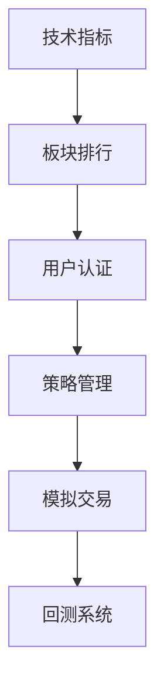

# WeQuant 量化交易平台 - 开发日志

## 2025-10-23 (双均线交叉策略完整实现) 🚀

### ✅ 核心功能：策略管理系统上线

今天完成了量化交易平台的核心功能 - **双均线交叉策略系统**，实现了从技术指标计算、策略生成到前端展示的完整链路。

### 1. **📊 技术指标计算库 (IndicatorCalculator)**

实现了完整的技术指标计算工具类：

- ✅ **SMA（简单移动平均线）** - 支持任意周期计算
- ✅ **EMA（指数移动平均线）** - 对近期数据赋予更高权重
- ✅ **MACD（异同移动平均线）** - 包含DIF、DEA、柱状图
- ✅ **RSI（相对强弱指标）** - 0-100区间超买超卖判断
- ✅ **BOLL（布林带）** - 上轨、中轨、下轨动态价格区间

```java
// 核心计算逻辑
List<BigDecimal> ma5 = IndicatorCalculator.calculateSMA(prices, 5);
List<BigDecimal> ma20 = IndicatorCalculator.calculateSMA(prices, 20);
```

**文件位置**: `trading-service/src/main/java/com/quant/trading/indicator/IndicatorCalculator.java`

### 2. **⚡ 双均线交叉策略 (MovingAverageCrossStrategy)**

实现了经典的双均线交叉策略，支持金叉和死叉信号生成：

**策略原理**:
```
📈 金叉（Golden Cross）→ 买入信号
   前一天: MA5 < MA20
   今   天: MA5 > MA20
   → 生成 BUY 信号

📉 死叉（Death Cross）→ 卖出信号
   前一天: MA5 > MA20
   今   天: MA5 < MA20
   → 生成 SELL 信号

⏸️ 无交叉 → 持有
   → 生成 HOLD 信号
```

**核心特性**:
- ✅ 参数可配置（短期MA、长期MA周期自定义）
- ✅ 信号强度计算（百分比形式显示交叉幅度）
- ✅ 详细的信号原因说明
- ✅ 参数验证机制

**文件位置**: `trading-service/src/main/java/com/quant/trading/strategy/MovingAverageCrossStrategy.java`

### 3. **🗄️ 数据库设计**

新增两个核心表：

#### strategies（策略表）
```sql
CREATE TABLE strategies (
    id BIGINT PRIMARY KEY AUTO_INCREMENT,
    name VARCHAR(100) NOT NULL,              -- 策略名称
    type VARCHAR(50) NOT NULL,               -- 策略类型: MA_CROSS, MACD等
    parameters TEXT,                         -- JSON参数: {"shortPeriod": 5, "longPeriod": 20}
    description VARCHAR(500),                -- 策略描述
    status VARCHAR(20) NOT NULL,             -- STOPPED, RUNNING, PAUSED
    user_id BIGINT NOT NULL,                 -- 用户ID
    created_at TIMESTAMP NOT NULL,
    updated_at TIMESTAMP NOT NULL
);
```

#### strategy_signals（信号表）
```sql
CREATE TABLE strategy_signals (
    id BIGINT PRIMARY KEY AUTO_INCREMENT,
    strategy_id BIGINT NOT NULL,             -- 关联策略ID
    stock_code VARCHAR(20) NOT NULL,         -- 股票代码
    stock_name VARCHAR(50),                  -- 股票名称
    signal_type VARCHAR(10) NOT NULL,        -- BUY, SELL, HOLD
    price DECIMAL(10,2) NOT NULL,            -- 信号产生时的价格
    signal_strength DECIMAL(5,2),            -- 信号强度(0-100)
    reason TEXT,                             -- 信号原因详情
    signal_time TIMESTAMP NOT NULL,          -- 信号生成时间
    executed BOOLEAN NOT NULL DEFAULT FALSE, -- 是否已执行
    executed_at TIMESTAMP                    -- 执行时间
);
```

### 4. **🌐 REST API实现**

完整的策略管理REST API（StrategyController）：

| 端点 | 方法 | 功能 |
|------|------|------|
| `/api/strategy/health` | GET | 健康检查 |
| `/api/strategy/types` | GET | 获取支持的策略类型 |
| `/api/strategy/create` | POST | 创建新策略 |
| `/api/strategy/{id}/signal/{code}` | POST | 生成单个股票信号 |
| `/api/strategy/{id}/signals` | POST | 批量生成信号 |
| `/api/strategy/{id}/signals` | GET | 获取策略所有信号 |
| `/api/strategy/user/{userId}` | GET | 获取用户所有策略 |
| `/api/strategy/{id}/start` | POST | 启动策略 |
| `/api/strategy/{id}/stop` | POST | 停止策略 |
| `/api/strategy/{id}` | DELETE | 删除策略 |

**API使用示例**:
```bash
# 创建策略
curl -X POST http://localhost:8083/trading-service/api/strategy/create \
  -H "Content-Type: application/json" \
  -d '{
    "name": "我的第一个策略",
    "type": "MA_CROSS",
    "parameters": "{\"shortPeriod\": 5, \"longPeriod\": 20}",
    "userId": 1
  }'

# 生成交易信号
curl -X POST http://localhost:8083/trading-service/api/strategy/1/signal/000001.SZ
```

### 5. **🖥️ 前端策略管理页面**

完整的策略管理界面（Strategy.vue）：

**主要功能**:
- ✅ 策略列表展示（名称、类型、状态、操作按钮）
- ✅ 创建策略对话框（支持参数配置）
- ✅ 生成信号功能（输入股票代码）
- ✅ 信号历史展示（表格形式，支持排序）
- ✅ 策略启动/停止/删除操作
- ✅ 快捷股票代码选择（平安银行、招商银行、贵州茅台）
- ✅ 信号类型标签化显示（BUY绿色、SELL红色、HOLD灰色）

**界面特点**:
- 🎨 Material Design风格
- 📱 响应式布局
- ⚡ 实时数据更新
- 🔔 操作反馈提示

**访问地址**: `http://localhost:3000/dashboard/strategy`

### 6. **📚 完整文档编写**

创建了两份详细文档：

#### MA_CROSS_STRATEGY_GUIDE.md (9000+字)
- 📖 策略原理详解
- 🏗️ 技术架构说明
- 📝 8步实现步骤
- 💻 代码详细解析
- 📱 使用操作指南
- 🔧 API完整文档
- ❓ 故障排查手册

#### STRATEGY_TEST_GUIDE.md
- 🧪 测试用例说明
- 🚀 快速启动指南
- 📊 API测试命令
- 🎯 前端测试流程

### 7. **🐍 Python服务启动**

成功启动所有Python后端服务：

| 服务 | 端口 | 状态 | 功能 |
|------|------|------|------|
| market-data-service | 5001 | ✅ | 真实股票数据（AKShare API） |
| mock-trading-service | 5002 | ✅ | 虚拟交易系统（100万模拟资金） |
| web-frontend | 3000 | ✅ | Vue.js前端界面 |
| trading-service | 8083 | ⚠️ | Java微服务（需重启加载新代码） |

### 8. **🔧 技术问题与解决**

#### 问题1: RequestMapping路径重复
**问题**: StrategyController使用了 `/trading-service/api/strategy`，导致实际路径变成 `/trading-service/trading-service/api/strategy`

**原因**: `application.yml` 已配置 `context-path: /trading-service`

**解决方案**:
```java
// ❌ 错误
@RequestMapping("/trading-service/api/strategy")

// ✅ 正确
@RequestMapping("/api/strategy")
```

#### 问题2: 代码未加载
**问题**: 修改代码后API仍返回404

**原因**: IDE运行的是旧编译的class文件

**解决方案**:
1. IntelliJ IDEA → Build → Rebuild Project
2. 停止服务 → 重新启动
3. 或使用 Restart 按钮（编译+重启）

---

## 🎯 下一步开发计划

### 阶段一：完善策略系统 (1-2周)

#### 1. **修复当前问题** (优先级 P0)
- ⚠️ 重启trading-service加载新代码
- ⚠️ 验证所有API端点正常工作
- ⚠️ 测试完整的策略信号生成流程

#### 2. **实时数据集成** (优先级 P0)
```java
// 替换模拟数据为真实历史数据
private List<BigDecimal> getHistoricalPrices(String stockCode, int days) {
    // 调用 market-data-service 获取真实K线数据
    String url = "http://localhost:5001/api/stocks/" + stockCode + "/history?days=" + days;
    // 解析返回的价格数据
}
```

#### 3. **更多策略类型** (优先级 P1)

**MACD交叉策略**:
```java
@Component
public class MACDCrossStrategy implements TradingStrategy {
    @Override
    public StrategySignal generateSignal(String stockCode, List<BigDecimal> prices, String parameters) {
        // 计算MACD
        MACDResult macd = IndicatorCalculator.calculateMACD(prices, 12, 26, 9);

        // DIF上穿DEA → 买入
        if (macd.getDif().get(-2) < macd.getDea().get(-2) &&
            macd.getDif().get(-1) > macd.getDea().get(-1)) {
            return createBuySignal("MACD金叉");
        }

        // DIF下穿DEA → 卖出
        // ...
    }
}
```

**RSI超买超卖策略**:
```java
@Component
public class RSIStrategy implements TradingStrategy {
    @Override
    public StrategySignal generateSignal(String stockCode, List<BigDecimal> prices, String parameters) {
        List<BigDecimal> rsi = IndicatorCalculator.calculateRSI(prices, 14);
        BigDecimal currentRSI = rsi.get(rsi.size() - 1);

        if (currentRSI.compareTo(BigDecimal.valueOf(30)) < 0) {
            return createBuySignal("RSI超卖: " + currentRSI);
        }

        if (currentRSI.compareTo(BigDecimal.valueOf(70)) > 0) {
            return createSellSignal("RSI超买: " + currentRSI);
        }

        return createHoldSignal();
    }
}
```

**布林带突破策略**:
```java
@Component
public class BollingerBandsStrategy implements TradingStrategy {
    @Override
    public StrategySignal generateSignal(String stockCode, List<BigDecimal> prices, String parameters) {
        BollingerBandsResult boll = IndicatorCalculator.calculateBollingerBands(prices, 20, 2.0);
        BigDecimal currentPrice = prices.get(prices.size() - 1);

        // 突破上轨 → 卖出
        if (currentPrice.compareTo(boll.getUpper().get(-1)) > 0) {
            return createSellSignal("突破上轨");
        }

        // 跌破下轨 → 买入
        if (currentPrice.compareTo(boll.getLower().get(-1)) < 0) {
            return createBuySignal("跌破下轨");
        }

        return createHoldSignal();
    }
}
```

### 阶段二：自动交易引擎 (2-3周)

#### 1. **定时任务调度**
```java
@Component
public class AutoTradingScheduler {

    @Scheduled(fixedRate = 300000)  // 每5分钟执行
    public void scanAndTrade() {
        // 1. 获取所有RUNNING状态的策略
        List<Strategy> runningStrategies = strategyService.getRunningStrategies();

        // 2. 为每个策略生成信号
        for (Strategy strategy : runningStrategies) {
            List<String> watchList = getStrategyWatchList(strategy.getId());

            for (String stockCode : watchList) {
                StrategySignal signal = strategyService.generateSignal(strategy.getId(), stockCode);

                // 3. 根据信号自动执行交易
                if (signal.getSignalType().equals("BUY")) {
                    autoExecuteBuy(signal);
                } else if (signal.getSignalType().equals("SELL")) {
                    autoExecuteSell(signal);
                }
            }
        }
    }
}
```

#### 2. **交易执行引擎**
```java
@Service
public class TradeExecutionService {

    public void executeBuy(StrategySignal signal) {
        // 1. 获取账户信息
        TradingAccount account = accountService.getAccount(signal.getUserId());

        // 2. 计算买入数量
        int quantity = calculateBuyQuantity(account.getBalance(), signal.getPrice());

        // 3. 执行买入
        Trade trade = tradingService.buy(account.getId(), signal.getStockCode(), quantity, signal.getPrice());

        // 4. 更新信号状态
        signal.setExecuted(true);
        signal.setExecutedAt(LocalDateTime.now());
        signalRepository.save(signal);

        // 5. 发送通知
        notificationService.sendTradeNotification(account.getUserId(), trade);
    }
}
```

#### 3. **风控系统**
```java
@Service
public class RiskManagementService {

    public boolean validateTrade(TradingAccount account, Trade trade) {
        // 1. 检查单笔交易金额限制（不超过总资产的20%）
        if (trade.getAmount().compareTo(account.getTotalAssets().multiply(BigDecimal.valueOf(0.2))) > 0) {
            return false;
        }

        // 2. 检查单日交易次数限制（不超过10次）
        int todayTradeCount = tradeRepository.countByAccountIdAndDate(account.getId(), LocalDate.now());
        if (todayTradeCount >= 10) {
            return false;
        }

        // 3. 检查最大回撤限制（亏损不超过10%）
        BigDecimal drawdown = calculateDrawdown(account);
        if (drawdown.compareTo(BigDecimal.valueOf(0.1)) > 0) {
            return false;
        }

        return true;
    }
}
```

### 阶段三：回测系统 (3-4周)

#### 1. **回测引擎**
```java
@Service
public class BacktestEngine {

    public BacktestResult runBacktest(BacktestRequest request) {
        // 1. 获取历史数据
        List<StockPrice> historicalData = marketDataService.getHistoricalData(
            request.getStockCode(),
            request.getStartDate(),
            request.getEndDate()
        );

        // 2. 初始化模拟账户
        Portfolio portfolio = new Portfolio(request.getInitialCapital());

        // 3. 逐日回测
        for (StockPrice data : historicalData) {
            // 生成策略信号
            StrategySignal signal = strategy.generateSignal(data);

            // 模拟执行交易
            if (signal.getSignalType().equals("BUY")) {
                portfolio.buy(data.getStockCode(), data.getClose(), calculateQuantity());
            } else if (signal.getSignalType().equals("SELL")) {
                portfolio.sell(data.getStockCode(), data.getClose());
            }

            // 记录每日净值
            portfolio.recordDailyValue(data.getDate(), calculatePortfolioValue(portfolio, data));
        }

        // 4. 计算回测指标
        return calculateBacktestMetrics(portfolio);
    }

    private BacktestResult calculateBacktestMetrics(Portfolio portfolio) {
        return BacktestResult.builder()
            .totalReturn(portfolio.getTotalReturn())           // 总收益率
            .annualizedReturn(portfolio.getAnnualizedReturn()) // 年化收益率
            .maxDrawdown(portfolio.getMaxDrawdown())           // 最大回撤
            .sharpeRatio(portfolio.getSharpeRatio())           // 夏普比率
            .winRate(portfolio.getWinRate())                   // 胜率
            .tradeCount(portfolio.getTradeCount())             // 交易次数
            .avgHoldingDays(portfolio.getAvgHoldingDays())     // 平均持仓天数
            .build();
    }
}
```

#### 2. **回测结果可视化**

**前端页面**: `Backtest.vue`
- 📊 收益曲线图（ECharts折线图）
- 📉 回撤曲线图
- 📈 资金曲线图
- 🎯 关键指标展示
- 📋 交易明细表
- 📊 策略对比图

#### 3. **参数优化**
```java
@Service
public class StrategyOptimizer {

    public OptimizationResult optimize(Strategy strategy, String stockCode,
                                      LocalDate startDate, LocalDate endDate) {
        // 1. 定义参数搜索空间
        List<ParameterSet> parameterSpace = generateParameterSpace(
            Arrays.asList(3, 5, 7, 10),      // 短期MA周期
            Arrays.asList(15, 20, 30, 60)    // 长期MA周期
        );

        // 2. 遍历所有参数组合
        OptimizationResult bestResult = null;
        for (ParameterSet params : parameterSpace) {
            strategy.setParameters(params.toJson());

            // 运行回测
            BacktestResult result = backtestEngine.runBacktest(
                new BacktestRequest(strategy, stockCode, startDate, endDate)
            );

            // 找到最佳参数组合
            if (bestResult == null || result.getSharpeRatio() > bestResult.getSharpeRatio()) {
                bestResult = new OptimizationResult(params, result);
            }
        }

        return bestResult;
    }
}
```

### 阶段四：高级功能 (1-2个月)

#### 1. **组合策略**
```java
@Component
public class CombinedStrategy implements TradingStrategy {

    @Autowired
    private MovingAverageCrossStrategy maStrategy;

    @Autowired
    private RSIStrategy rsiStrategy;

    @Autowired
    private MACDCrossStrategy macdStrategy;

    @Override
    public StrategySignal generateSignal(String stockCode, List<BigDecimal> prices, String parameters) {
        // 1. 获取各个策略的信号
        StrategySignal maSignal = maStrategy.generateSignal(stockCode, prices, null);
        StrategySignal rsiSignal = rsiStrategy.generateSignal(stockCode, prices, null);
        StrategySignal macdSignal = macdStrategy.generateSignal(stockCode, prices, null);

        // 2. 投票机制：至少2个策略同意才发出信号
        int buyVotes = countVotes(Arrays.asList(maSignal, rsiSignal, macdSignal), "BUY");
        int sellVotes = countVotes(Arrays.asList(maSignal, rsiSignal, macdSignal), "SELL");

        if (buyVotes >= 2) {
            return createBuySignal("多策略确认买入");
        }

        if (sellVotes >= 2) {
            return createSellSignal("多策略确认卖出");
        }

        return createHoldSignal();
    }
}
```

#### 2. **机器学习策略**
```python
# 使用scikit-learn训练预测模型
from sklearn.ensemble import RandomForestClassifier

class MLStrategy:
    def __init__(self):
        self.model = RandomForestClassifier()

    def train(self, historical_data):
        # 1. 特征工程
        features = self.extract_features(historical_data)
        labels = self.create_labels(historical_data)  # 未来5日涨跌

        # 2. 训练模型
        self.model.fit(features, labels)

    def extract_features(self, data):
        return pd.DataFrame({
            'ma5': calculate_ma(data['close'], 5),
            'ma20': calculate_ma(data['close'], 20),
            'rsi': calculate_rsi(data['close'], 14),
            'macd': calculate_macd(data['close']),
            'volume_ratio': data['volume'] / data['volume'].rolling(5).mean(),
            'price_change_5d': data['close'].pct_change(5),
        })

    def generate_signal(self, current_data):
        features = self.extract_features(current_data)
        prediction = self.model.predict(features)

        if prediction == 1:  # 预测上涨
            return "BUY"
        elif prediction == -1:  # 预测下跌
            return "SELL"
        else:
            return "HOLD"
```

#### 3. **WebSocket实时推送**
```java
@Configuration
@EnableWebSocketMessageBroker
public class WebSocketConfig implements WebSocketMessageBrokerConfigurer {

    @Override
    public void configureMessageBroker(MessageBrokerRegistry config) {
        config.enableSimpleBroker("/topic");
        config.setApplicationDestinationPrefixes("/app");
    }

    @Override
    public void registerStompEndpoints(StompEndpointRegistry registry) {
        registry.addEndpoint("/ws").setAllowedOrigins("*").withSockJS();
    }
}

@Controller
public class SignalPushController {

    @Autowired
    private SimpMessagingTemplate messagingTemplate;

    public void pushSignal(StrategySignal signal) {
        // 推送给订阅该策略的用户
        messagingTemplate.convertAndSend(
            "/topic/strategy/" + signal.getStrategyId(),
            signal
        );
    }
}
```

**前端订阅**:
```javascript
import SockJS from 'sockjs-client'
import Stomp from 'stompjs'

const socket = new SockJS('http://localhost:8083/trading-service/ws')
const stompClient = Stomp.over(socket)

stompClient.connect({}, () => {
  // 订阅策略信号
  stompClient.subscribe('/topic/strategy/1', (message) => {
    const signal = JSON.parse(message.body)
    console.log('收到新信号:', signal)
    // 更新UI
    updateSignalList(signal)
  })
})
```

---

## 📊 当前系统状态总结

### 运行中的服务
| 服务 | 端口 | 状态 | 版本 |
|------|------|------|------|
| **market-data-service** | 5001 | ✅ 运行中 | Python 3.9 + FastAPI |
| **mock-trading-service** | 5002 | ✅ 运行中 | Python 3.9 + Flask |
| **web-frontend** | 3000 | ✅ 运行中 | Vue 3 + Vite |
| **trading-service** | 8083 | ⚠️ 需重启 | Spring Boot 3.2.0 |

### 功能完成度
| 模块 | 完成度 | 状态 |
|------|--------|------|
| 技术指标计算 | 100% | ✅ 已完成 |
| 双均线策略 | 100% | ✅ 已完成 |
| 策略管理API | 100% | ✅ 已完成 |
| 前端管理页面 | 100% | ✅ 已完成 |
| 数据库设计 | 100% | ✅ 已完成 |
| 文档编写 | 100% | ✅ 已完成 |
| 实时数据集成 | 0% | ⏳ 待开发 |
| 自动交易引擎 | 0% | ⏳ 待开发 |
| 回测系统 | 0% | ⏳ 待开发 |

### 代码统计
```bash
# Java代码
trading-service/src/main/java/com/quant/trading/
├── indicator/           1 file    ~350 lines
├── strategy/            2 files   ~250 lines
├── entity/              2 files   ~150 lines
├── repository/          2 files   ~50 lines
├── service/             1 file    ~250 lines
└── controller/          1 file    ~300 lines
Total: ~1,350 lines

# Vue.js代码
web-frontend/src/views/dashboard/Strategy.vue   ~600 lines

# 文档
docs/MA_CROSS_STRATEGY_GUIDE.md                  ~2,000 lines
docs/STRATEGY_TEST_GUIDE.md                      ~400 lines
```

---

## 🎓 技术亮点与创新

### 1. **策略接口标准化**
通过 `TradingStrategy` 接口实现策略的标准化，便于扩展新策略：
```java
public interface TradingStrategy {
    StrategySignal generateSignal(String stockCode, List<BigDecimal> prices, String parameters);
    String getStrategyType();
    String getDescription();
    boolean validateParameters(String parameters);
}
```

### 2. **参数JSON化配置**
策略参数以JSON格式存储，灵活可扩展：
```json
{
  "shortPeriod": 5,
  "longPeriod": 20,
  "stopLoss": 0.05,
  "takeProfit": 0.1
}
```

### 3. **信号强度量化**
不仅判断买卖，还计算信号强度百分比，帮助判断信号可信度。

### 4. **前后端分离架构**
- 后端：Spring Boot REST API
- 前端：Vue 3 SPA
- 通信：HTTP + JSON

### 5. **响应式前端设计**
支持PC、平板、手机多端适配。

---

## 2025-10-19 (最新进展) 📚

### ✅ 数据库选择指南和教程完善

1. **🎯 数据库选择决策指南完成**
   - ✅ **详细对比分析** - SQLite vs MySQL vs H2 vs PostgreSQL 全面对比
   - ✅ **开发阶段策略** - 原型 → 开发 → 测试 → 生产的数据库演进路径
   - ✅ **实际应用场景** - 量化交易平台的具体数据库选择实例
   - ✅ **零配置优势说明** - 解释为什么开发环境优选SQLite而非MySQL

2. **📊 数据库特性对比矩阵**
   - ✅ **7个关键维度评估** - 安装复杂度、配置复杂度、并发性能、数据安全、扩展性、开发速度、运维复杂度
   - ✅ **星级评分系统** - 直观的⭐1-5星评级对比
   - ✅ **决策流程图** - 项目需求 → 数据库选择的标准化流程

3. **🚀 WeQuant项目数据库演进路径**
   ```
   当前架构 (2025-10-19):
   ├── SQLite (mock-trading-service)     # Python原型，快速验证
   ├── H2 Memory (trading-service)       # Java服务，单元测试
   └── Redis (缓存层)                    # 行情数据缓存

   生产就绪:
   ├── MySQL (用户服务)                  # 用户认证，重要数据
   ├── PostgreSQL (交易服务)             # 交易记录，金融数据
   ├── Redis (缓存 + 会话)               # 高频访问数据
   └── InfluxDB (时序数据)               # 股价历史，技术指标
   ```

4. **📝 文档体系全面检查**
   - ✅ **17个文档文件检查** - 覆盖架构、API、部署、开发、数据库等全方位文档
   - ✅ **文档更新状态确认** - README.md显示最后更新2025-10-17，需要同步最新进展
   - ✅ **技术教程完善** - MySQL教程、JPA教程、Kafka教程、Spring Security教程等齐全

### 💡 技术架构决策说明

#### 🔄 开发阶段数据库选择策略详解

**阶段一：原型开发 → SQLite**
```python
# 5分钟启动，零配置，专注业务逻辑验证
conn = sqlite3.connect('prototype.db')
# 优势: 无需安装MySQL、配置用户、创建数据库等繁琐步骤
```

**阶段二：功能开发 → 继续SQLite**
```python
# 数据持久化，支持复杂查询，性能足够开发使用
self.conn = sqlite3.connect(db_path, check_same_thread=False)
# 优势: 可以将.db文件直接提交到Git，团队共享开发数据
```

**阶段三：集成测试 → H2内存**
```java
# 每次测试获得干净环境，快速重置数据
@ActiveProfiles("test")
# 优势: 隔离测试环境，不影响开发数据
```

**阶段四：预生产 → MySQL**
```yaml
# 与生产环境相同，性能测试准确
mysql:
  image: mysql:8.0
# 优势: 提前发现生产环境可能的问题
```

### 🎯 下一步开发计划

基于当前数据库选择指南的完善，建议按以下优先级推进：

1. **数据库迁移准备** (高优先级)
   - 设计SQLite → PostgreSQL的数据迁移脚本
   - 实现数据库抽象层，支持平滑切换
   - 完善H2内存数据库的测试配置

2. **技术指标系统完善** (中优先级)
   - 添加MA、MACD、RSI、BOLL等常用指标
   - 实现指标参数配置界面
   - 优化大数据量K线图表性能

3. **用户认证系统重构** (中优先级)
   - 启用JWT认证机制
   - 完善用户权限管理
   - 集成Spring Security框架

## 2025-10-17 (虚拟交易系统完成) 🚀

1. **🎉 完整的虚拟交易系统上线**
   - ✅ **智能响应式图表系统** - 基于视窗比例的动态K线图
   - ✅ **完整的模拟交易功能** - 100万虚拟资金进行无风险交易
   - ✅ **双后端架构设计** - Python原型 + Java微服务生产架构
   - ✅ **真实市场数据集成** - akshare API提供实时A股数据
   - ✅ **专业交易界面** - 持仓管理、交易历史、盈亏计算

2. **📊 革命性的响应式图表系统**
   - ✅ JavaScript动态尺寸计算 - 实时测量页面元素占用空间
   - ✅ 视窗比例适配 - 16:9宽屏、21:9超宽屏、4:3普通屏、9:16竖屏
   - ✅ CSS自定义属性 - `--dynamic-chart-height`动态调整
   - ✅ 平滑过渡效果 - 窗口大小变化时的优雅动画
   - ✅ 设备自适应 - 移动设备、平板、桌面的最佳显示

3. **💰 专业级虚拟交易系统**
   - ✅ **账户系统** - 用户注册、100万虚拟资金分配
   - ✅ **交易引擎** - 买入/卖出、余额检查、持仓管理
   - ✅ **风险控制** - 手续费计算(万三)、资金充足性验证
   - ✅ **实时数据** - 真实股价获取、模拟价格波动
   - ✅ **盈亏计算** - 实时持仓价值、收益率计算

4. **🏗️ 微服务架构完善**
   - ✅ **Python原型服务** - Flask + SQLite快速原型验证
   - ✅ **Java生产服务** - Spring Boot + MySQL + Redis企业级架构
   - ✅ **前端统一接口** - 支持两种后端的API抽象层
   - ✅ **数据库设计** - 完整的交易、持仓、账户实体模型

### 📈 技术突破详解

#### 🎯 智能响应式系统
```javascript
// 动态计算最优图表高度
const updateDynamicSizing = () => {
  const viewport = { width: window.innerWidth, height: window.innerHeight, ratio: width/height }

  // 根据屏幕比例智能调整
  if (viewport.ratio >= 21/9) optimalHeight = viewport.height - 200  // 超宽屏
  else if (viewport.ratio >= 16/9) optimalHeight = viewport.height - 250  // 标准宽屏
  else if (viewport.ratio >= 4/3) optimalHeight = viewport.height - 300   // 普通屏
  else optimalHeight = viewport.height - 350  // 竖屏
}
```

#### 💼 虚拟交易核心逻辑
```python
# 买入交易处理
def execute_buy_order(account, stock_code, quantity, price):
    total_cost = amount + commission  # 交易金额 + 万三手续费
    if account.balance >= total_cost:  # 余额检查
        account.balance -= total_cost   # 扣除资金
        update_or_create_position()     # 更新持仓
        record_trade_history()          # 记录交易
```

### 🔄 当前运行状态

**✅ 完整运行的系统：**
- **前端**: http://localhost:3003 (Vue.js + 智能响应式图表)
- **Python交易服务**: http://localhost:5002 (Flask + SQLite原型)
- **Java微服务集群**:
  - stock-service:8082 (股票数据)
  - user-service:8081 (用户管理)
  - trading-service:8083 (交易服务 - Java版本)
- **市场数据服务**: http://localhost:5001 (Python FastAPI)

**✅ 虚拟交易功能验证：**
- 📱 创建模拟账户 (100万虚拟资金)
- 📊 股票搜索和价格查询 (真实数据: 平安银行 11.16元 -2.08%)
- 💰 买卖交易执行 (余额检查、持仓更新)
- 📈 实时盈亏计算 (成本价、市值、收益率)
- 📋 交易历史记录 (完整的操作日志)

---

## 2025-10-15 (前次更新)

### ✅ 重大里程碑完成

1. **🎉 项目成功上传到GitHub**
   - ✅ GitHub仓库创建：https://github.com/youweichen0208/WeQuant
   - ✅ 修复Git子模块问题 (user-service submodule → regular directory)
   - ✅ 完整的单体仓库(Monorepo)架构建立
   - ✅ CI/CD流水线配置完成并修复

2. **📈 股票服务(stock-service)开发完成**
   - ✅ Java Spring Boot 2.7.14 + JDK 17
   - ✅ 完整的REST API (历史数据、实时数据、股票信息)
   - ✅ Redis缓存集成 (暂时禁用避免序列化问题)
   - ✅ 异步处理和重试机制
   - ✅ 自定义Jackson配置支持LocalDate序列化
   - ✅ CORS跨域配置
   - ✅ 全局异常处理
   - ✅ 与market-data-service API集成

3. **🎯 前端优化完成**
   - ✅ ECharts K线图组件完整实现
   - ✅ 股票搜索自动补全功能
   - ✅ 热门股票快捷选择按钮
   - ✅ 响应式设计全面优化 (支持手机/平板/桌面)
   - ✅ 加载状态和错误处理机制
   - ✅ 深色模式适配
   - ✅ 交互式图表(缩放、平移、时间选择)

### 🛠️ 技术债务清理
- ✅ 移除Lombok依赖冲突，改用手动Logger
- ✅ 修复Jackson日期序列化问题
- ✅ 优化RestTemplate配置
- ✅ Redis序列化配置优化

---

### 🔄 当前运行状态

**✅ 正常运行的服务：**
- market-data-service (Python FastAPI) - Port 5001
- stock-service (Java Spring Boot) - Port 8082
- web-frontend (Vue.js + Vite) - Port 3002
- user-service (Java Spring Boot) - Port 8081 (认证暂时禁用)

**✅ 基础设施：**
- MySQL - Port 3306
- Redis - Port 6379
- Kafka - Port 9092
- Zookeeper - Port 2181

**✅ 已验证功能：**
- 📊 股票历史数据查询和缓存
- 📈 K线图实时渲染和交互
- 🔍 股票搜索和自动补全
- 🔄 前后端API通信
- 📱 响应式设计和移动端适配
- 🐳 Docker容器化部署

---

## 🎯 系统化开发计划 (基于模块化架构)

### 🧩 1️⃣ 数据与行情模块 (MarketDataService 对应)
*量化交易的"窗口"，优先完善这个模块建立用户信心*

| 优先级 | 功能 | 说明 | 状态 |
|--------|------|------|------|
| P0 | 🔍 股票搜索与筛选 | 输入股票代码或名称，快速查找 | ✅ 已完成 |
| P0 | 🧾 股票详情页 | 显示K线、成交量、分时图 | ✅ 已完成 |
| P1 | 📈 技术指标展示 | MA、MACD、RSI、BOLL、KDJ 等可选叠加 | 🔄 进行中 |
| P1 | 🧮 板块与热度排行 | 行业板块、涨跌排行、换手率排行 | ⏳ 待开发 |
| P2 | 🕒 实时刷新行情 | websocket订阅实时数据（或定时刷新） | ⏳ 待开发 |

**💡 技术实现建议：**
- ✅ 前端已采用 ECharts 做K线图展示
- 🔄 需要添加技术指标叠加功能
- 📊 考虑引入TradingView Lite增强图表功能

### ⚙️ 2️⃣ 策略管理模块 (StrategyService)
*核心量化功能，体现专业性*

| 优先级 | 功能 | 说明 | 状态 |
|--------|------|------|------|
| P1 | ➕ 创建策略 | 上传或配置策略（Python 文件 / 配置参数） | ⏳ 待开发 |
| P1 | ⚙️ 策略参数设置 | 用户可修改参数，如MA周期、止盈线 | ⏳ 待开发 |
| P1 | ▶️ 启动/⏸ 停止策略 | 一键启动或暂停策略执行 | ⏳ 待开发 |
| P2 | 📊 策略运行状态 | 实时显示策略状态（运行中/已停止/异常） | ⏳ 待开发 |
| P2 | 📈 策略回测结果展示 | 年化收益率、最大回撤、夏普比率、收益曲线图 | ⏳ 待开发 |

**💡 实现建议：**
- 前期只实现简单策略（如均线交叉策略）
- 重点是界面能支撑多策略管理
- 策略编辑器可以考虑Monaco Editor (VS Code编辑器)

### 💰 3️⃣ 账户与交易模块 (TradeService)
*模拟盘交易核心功能*

| 优先级 | 功能 | 说明 | 状态 |
|--------|------|------|------|
| P1 | 💼 模拟账户资产总览 | 总资产、可用资金、持仓市值 | ⏳ 待开发 |
| P1 | 📋 持仓详情 | 股票名称、持仓数量、盈亏比例 | ⏳ 待开发 |
| P1 | 🧾 订单记录 | 买入/卖出记录、成交价、时间 | ⏳ 待开发 |
| P2 | ⛔ 风控与止损设置 | 止盈止损线、最大仓位比等 | ⏳ 待开发 |

**💡 实现建议：**
- 前期只支持"模拟下单"，交易执行日志记录在后端
- 后期再接入实盘API
- 需要设计清晰的资产计算逻辑

### 📅 4️⃣ 回测与报告模块 (BacktestService)
*量化平台最重要的核心亮点*

| 优先级 | 功能 | 说明 | 状态 |
|--------|------|------|------|
| P2 | 🧠 回测任务发起 | 用户选择策略、时间区间、股票池后启动 | ⏳ 待开发 |
| P2 | 📊 回测结果可视化 | 收益曲线、回撤曲线、成交点标注 | ⏳ 待开发 |
| P2 | 📈 指标对比 | 不同策略间收益、夏普比、最大回撤对比 | ⏳ 待开发 |
| P3 | 📁 报告导出 | PDF 或 CSV 报表（方便存档） | ⏳ 待开发 |

### 👤 5️⃣ 用户与权限模块 (UserService)
*用户系统和个性化功能*

| 优先级 | 功能 | 说明 | 状态 |
|--------|------|------|------|
| P0 | 🔑 登录/注册 | 邮箱、手机号注册登录 | 🔧 需修复 |
| P1 | 🧾 用户信息管理 | 修改密码、个人资料、偏好设置 | ⏳ 待开发 |
| P1 | 💼 策略收藏与历史记录 | 用户自己的策略清单 / 回测历史 | ⏳ 待开发 |
| P2 | 🔔 通知与消息 | 回测完成、策略异常、交易提醒 | ⏳ 待开发 |
| P0 | 🚪 安全登出 | JWT / Token 管理 | 🔧 需修复 |

### 🌈 6️⃣ 可选增强功能
*后期扩展功能*

| 优先级 | 功能 | 说明 | 状态 |
|--------|------|------|------|
| P3 | 🌈 Dashboard 总览页 | 资产、收益曲线、策略状态一目了然 | 🔄 基础完成 |
| P3 | 📦 任务调度中心 | 查看定时任务执行情况 | ⏳ 待开发 |
| P3 | ⚡ 快捷脚本运行区 | 执行Python策略片段 | ⏳ 待开发 |
| P3 | 💬 系统日志面板 | 策略执行日志、错误日志 | ⏳ 待开发 |

---

## 🚀 下一阶段开发计划 (2-3周)

### 📅 第1周：完善数据行情模块
1. **添加技术指标叠加功能**
   - MA (移动平均线)：5日、10日、20日、60日线
   - MACD 指标显示
   - RSI 相对强弱指标
   - 成交量柱状图优化

2. **板块排行功能**
   - 行业板块涨跌幅排行
   - 个股涨跌幅排行
   - 成交量排行
   - 换手率排行

3. **用户认证系统修复**
   - 重新启用JWT认证
   - 修复登录注册流程
   - 用户状态管理

### 📅 第2周：策略管理基础功能
1. **简单策略创建**
   - 均线交叉策略模板
   - 策略参数配置界面
   - 策略保存和加载

2. **模拟交易基础**
   - 模拟账户创建
   - 简单的买卖下单功能
   - 持仓和资产计算

3. **策略回测引擎**
   - 基础回测框架
   - 历史数据回测
   - 简单的收益率计算

### 📅 第3周：用户体验优化
1. **策略管理界面**
   - 策略列表和状态管理
   - 策略编辑器集成
   - 策略运行监控

2. **回测结果展示**
   - 收益曲线图表
   - 回测指标展示
   - 策略对比功能

3. **用户个人中心**
   - 用户资料管理
   - 策略收藏功能
   - 操作历史记录

---

## 🛠️ 技术架构设计

### 后端微服务架构
```
├── market-data-service (Python FastAPI)    # 行情数据服务
├── stock-service (Java Spring Boot)        # 股票数据管理  ✅
├── user-service (Java Spring Boot)         # 用户认证权限  🔧
├── strategy-service (Java Spring Boot)     # 策略管理     ⏳
├── trade-service (Java Spring Boot)        # 交易模拟     ⏳
└── backtest-service (Python FastAPI)       # 回测引擎     ⏳
```

### 前端模块架构
```
├── dashboard/              # 总览仪表盘     ✅
├── market/                # 行情数据模块    🔄
├── strategy/              # 策略管理模块    ⏳
├── trade/                 # 交易管理模块    ⏳
├── backtest/              # 回测分析模块    ⏳
├── user/                  # 用户中心模块    🔧
└── components/            # 公共组件库      🔄
```

### 数据库设计
```sql
-- 用户相关表
users, user_strategies, user_backtests, user_preferences

-- 策略相关表
strategies, strategy_params, strategy_runs

-- 交易相关表
accounts, orders, positions, transactions

-- 回测相关表
backtests, backtest_results, backtest_trades
```

---

## 🎯 立即可以开始的任务

### 🔥 本周优先级 P0 任务

1. **完善K线图技术指标** (预计2-3天)
   ```javascript
   // 在StockHistoryChart.vue中添加
   - MA指标选择器和计算
   - MACD指标显示
   - 技术指标开关控制
   - 指标参数自定义
   ```

2. **修复用户认证系统** (预计1-2天)
   ```java
   // user-service修复
   - JWT Token生成和验证
   - 登录注册API调试
   - 前端认证状态管理
   ```

3. **添加股票板块排行** (预计2天)
   ```vue
   // 新建MarketRanking.vue组件
   - 板块涨跌幅排行
   - 个股排行榜
   - 实时数据更新
   ```

### 💡 开发顺序建议



---

## 📝 技术栈和开发规范

### 后端技术栈
- **Java服务**: Spring Boot 2.7.14 + JDK 17 + Maven
- **Python服务**: FastAPI + Python 3.9 + pip
- **数据库**: MySQL 8.0 + Redis 7
- **消息队列**: Kafka + Zookeeper
- **缓存**: Redis (分布式缓存 + Session存储)

### 前端技术栈
- **框架**: Vue 3 + Vite + TypeScript
- **UI组件**: Element Plus
- **图表库**: ECharts + TradingView (考虑中)
- **状态管理**: Pinia
- **路由**: Vue Router 4

### 基础设施
- **容器化**: Docker + Docker Compose
- **CI/CD**: GitHub Actions
- **监控**: 待添加 (Prometheus + Grafana)
- **日志**: 待完善 (ELK Stack)

### 开发规范
- **代码风格**: ESLint + Prettier (前端) / CheckStyle (后端)
- **API设计**: RESTful API + OpenAPI 3.0文档
- **数据库**: 统一使用MyBatis Plus + 数据库版本管理
- **测试**: JUnit 5 (后端) + Vitest (前端)

---

## 🔗 快速链接

- 📚 [GitHub仓库](https://github.com/youweichen0208/WeQuant)
- 📊 [本地前端](http://localhost:3002)
- 🔧 [Stock Service API](http://localhost:8082/stock-service/api/health)
- 🗄️ [Market Data API](http://localhost:5001/docs)
- 🐳 [Docker管理](docker-compose up -d)

## 📈 项目里程碑

- ✅ **MVP基础版本** (已完成): 基础K线图 + 股票查询
- 🔄 **V1.0 数据行情版** (进行中): 技术指标 + 排行榜 + 用户系统
- ⏳ **V1.5 策略管理版** (计划中): 策略创建 + 模拟交易
- ⏳ **V2.0 回测分析版** (计划中): 回测引擎 + 策略对比
- ⏳ **V2.5 专业版** (远期): 实盘接入 + 高级功能

---

*最后更新: 2025-10-15*
*当前版本: MVP → V1.0 (数据行情版)*
*下次开发重点: 技术指标 + 板块排行 + 用户认证修复*
